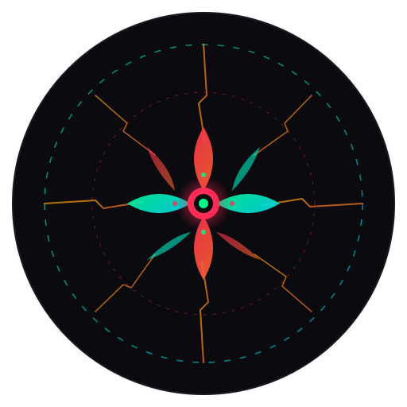

<div align="center">
  
  <h1>BLOOMVERSE</h1>
  <p><strong>Survive. Fight. Escape.</strong></p>
  <p>A premium single-player action survival game set in a collapsing multiverse.</p>

  <br />

  <a href="https://mkr-infinity.github.io/bloomverse">
    
  </a>

  <br /><br />

  
  
  
  
  
</div>

---

## About

Bloomverse is a fast-paced browser-based action survival game where you fight through waves of zombie-like enemies across a collapsing multiverse. Each level represents a distorted version of real-world environments filled with unique threats.

**No backend. No accounts. Fully offline after first load.**

## Features

- **6 Multiverse Worlds** — Abandoned City, Desert Ruins, Frozen Industrial Zone, Burning Urban Collapse, Floating Sky Fragments, Dark Void Dimension
- **5 Enemy Types** — Walkers, Runners, Tanks, Explosives, Bosses
- **Weapon System** — Multiple weapons with reload, upgrade, and switching mechanics
- **Wave-based Combat** — Progressive difficulty with increasing enemy variety
- **Tactical HUD** — Health, armor, ammo, XP, and wave indicators
- **Progression System** — Level up, unlock weapons, gain credits
- **Save System** — Auto-save with export/import via IndexedDB
- **PWA Support** — Install as app, play offline
- **Settings** — Audio, graphics, controls, difficulty, data management
- **Archive** — Track total kills, play time, deaths, achievements

## Tech Stack

| Technology | Purpose |
|---|---|
| React 18 | UI framework |
| TypeScript | Type safety |
| Vite 5 | Build tool |
| Zustand | State management |
| IndexedDB (idb) | Local persistence |
| Canvas API | Game rendering |
| Vite PWA | Offline support |
| CSS Modules | Scoped styling |

## Getting Started

### Prerequisites

- Node.js 18+
- pnpm

### Install

```bash
pnpm install
```

### Development

```bash
pnpm dev
```

### Build

```bash
pnpm build
```

### Preview Production Build

```bash
pnpm preview
```

## Controls

| Action | Key |
|---|---|
| Move | W A S D / Arrow Keys |
| Aim | Mouse |
| Shoot | Left Click |
| Reload | R |
| Switch Weapon | 1-9 |
| Pause | ESC |

## Deployment

This project auto-deploys to GitHub Pages via GitHub Actions on push to `main`.

To deploy manually:
```bash
pnpm build
```
Upload the `dist/` folder to any static hosting.

## Project Structure

```
src/
├── assets/        # Logo and SVG assets
├── components/    # UI components (HUD, overlays, particles)
├── game/          # Game engine (physics, rendering, input, levels)
├── pages/         # Route pages (menu, game, settings, etc.)
├── store/         # Zustand state management
├── styles/        # Global CSS and design tokens
└── utils/         # IndexedDB helpers
```

## Contributing

1. Fork the repository
2. Create your feature branch (`git checkout -b feat/amazing-feature`)
3. Commit your changes (`git commit -m 'feat: add amazing feature'`)
4. Push to the branch (`git push origin feat/amazing-feature`)
5. Open a Pull Request

## Support

- [Buy Me A Coffee](https://buymeacoffee.com/mkr_infinity)
- [GitHub](https://github.com/mkr-infinity)
- [Instagram](https://www.instagram.com/mkr_infinity)
- [Telegram](https://t.me/mkr_infinity)
- [Portfolio](https://mkr-infinity.github.io)

## License

MIT

---

<div align="center">
  <p>Built with intensity by <strong>MKR Infinity</strong></p>
</div>
